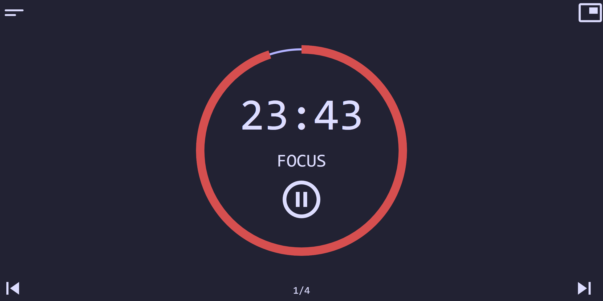
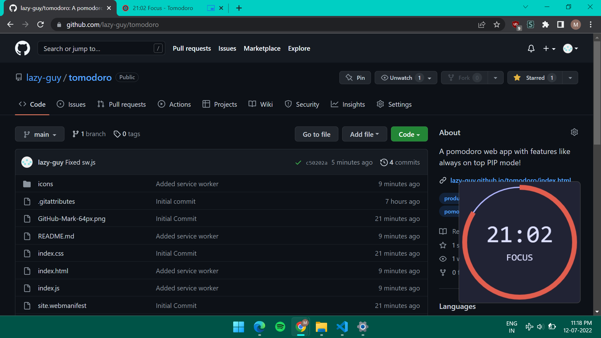

# Tomodoro
 A pomodoro web app with always on top mode!

## Features:
* Clean UI(Inspired from other pomodoro apps like [Pomotroid](https://github.com/Splode/pomotroid))
* Themes
* Works Offline
* **PIP/Always on Top mode!!**

## About Always On Top/PIP Mode
**Not tested on Safari but might work**

PIP mode works by drawing on a canvas, capturing its stream and using it as source of a video element. Then it requests Picture-In-Picture.

On desktop firefox, PIP button will only make the video visible but will not activate PIP. To switch to PIP mode, right click on the video and select "Watch in Picture-In-Picture".

On android browsers, like Chrome for Android which does not support the picture-in-piture API, in order to switch to PIP mode, make the video fullscreen and then go to your device's homescreen without exiting fullscreen. If your browser is supported then PIP mode will be activated.

## To-Do
* Make code cleaner
* Add custom theming