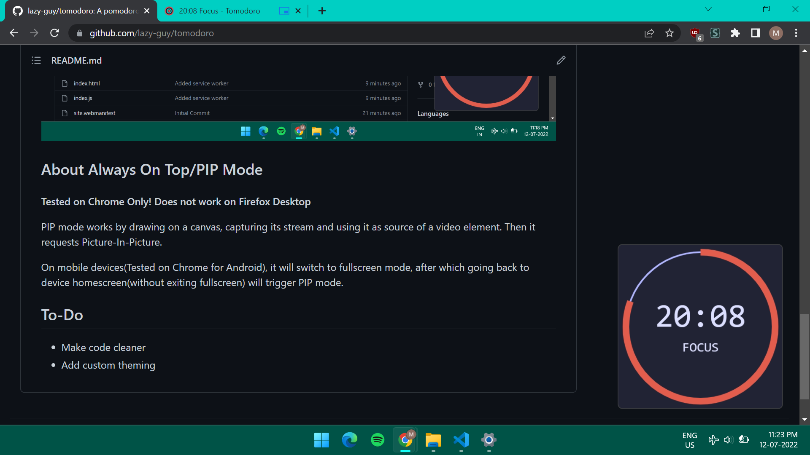

# Tomodoro
 A pomodoro web app with always on top mode!

## Features:
* Clean UI(Inspired from other pomodoro apps like [Pomotroid](https://github.com/Splode/pomotroid))
* Works Offline
* **PIP/Always on Top mode!!**

## About Always On Top/PIP Mode
**Tested on Chrome Only! Does not work on Firefox Desktop**

PIP mode works by drawing on a canvas, capturing its stream and using it as source of a video element. Then it requests Picture-In-Picture.

On mobile devices(Tested on Chrome for Android), it will switch to fullscreen mode, after which going back to device homescreen(without exiting fullscreen) will trigger PIP mode. 

## To-Do
* Make code cleaner
* Add custom theming